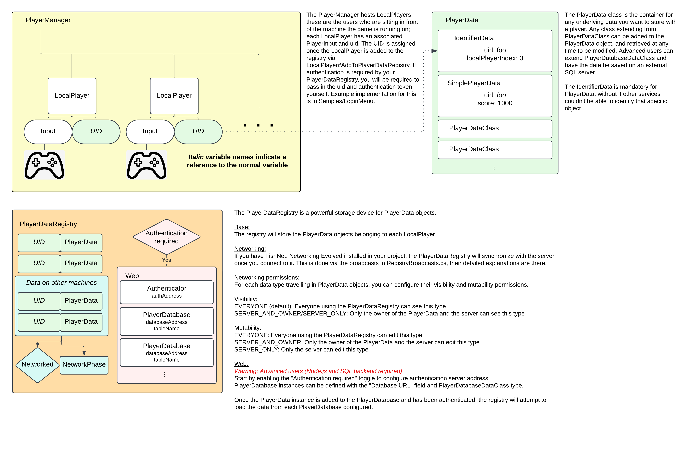

# Player Management

## Table of Contents
- [Introduction](#introduction)
- [Usage](#usage)
- [Getting Started](#getting-started)
- [Functionality](#functionality)

---

## Introduction
** Keep track of your local players when using the [Unity New Input System](https://docs.unity3d.com/Packages/com.unity.inputsystem@1.11/manual/index.html).<br>
** Store data for your players with the highly flexible PlayerData object.<br>
** Use the PlayerDataRegistry which acts as an infinite size container for any and all data you will 
need to store. This data will synchronize over the network if you're using FishNetworking.<br>
** Use web based storage to keep your data around for multiple sessions. (requires Node.js and SQL backend)<br>

# Usage

## Getting Started
Place the provided PlayerManager (found in samples folder) in a scene that will always be activated
(the PlayerManager will move to DoNotDestroyOnLoad once initialized). This ensures you will have
a new input system PlayerInputManager and a PlayerManager/PlayerDataRegistry combo in the game.

## PlayerManager
  1. Add a PlayerManager prefab sample to a bootstrapper scene.
  2. Once the PlayerManager prefab instantiates and goes to DoNotDestroyOnLoad LocalPlayer objects
  will be able to join.
  3. (Optional) If you want to use web based features for your data registry, you'll have to use
  some form of log in menu, see Samples/LogIn Menu for an example.
  
## PlayerDataRegistry
  1. Ensure [PlayerManager](#playermanager) is set up properly, PlayerDataRegistry requires a
  PlayerManager component on the same GameObject.
  2. When a LocalPlayer joins the PlayerManager, it will automatically be added to the
  PlayerDataRegistry, if authentication is required it will be requested by the PlayerManager.
  3. Access the PlayerDataRegistry and manipulate PlayerData:

  ```c#
  // Access the PlayerDataRegistry instance.
  PlayerDataRegistry registry = PlayerDataRegistry.Instance;

  // Get player data
  string uid = "your_uid_here"; // Either generated or provided from PlayerAuthenticator login result
  PlayerData playerData = registry.GetPlayerData(uid);

  // Load NameData for the player
  NameData nd = new();
  if(playerData.HasData<NameData>())
    nd = playerData.GetData<NameData>();


  nd.Name = "your_display_name";
  playerData.SetData(nd);
  ```

# Functionality
Here's an overview of the packages functions:


## PlayerManager
The PlayerManager hosts LocalPlayers, these are the users who are sitting in front of the machine 
the game is running on; each LocalPlayer has an associated PlayerInput and uid. The UID is assigned 
once the LocalPlayer is added to the registry via LocalPlayer#AddToPlayerDataRegistry. If 
authentication is required by your PlayerDataRegistry, you will be required to pass in the uid and 
authentication token yourself. Example implementation for this is in Samples/LoginMenu.

Connect an input prompt canvas, input prompt panel, and device missing panel to the component so
the PlayerManager can prompt the users for the necessary inputs.<br>
You can blacklist which scenes the primary player's control scheme will switch- this is mainly used
for scenes where other players need to join and we don't the primary player to take over.<br>
You can blacklist which scenes the player input prompt will appear- this is mainly used for the
title screen as it is assumed the player will join with input there.<br>
In code, you can track each local player through the PlayerManager#Instance#LocalPlayer array.<br>
A LocalPlayer object will give you the player's PlayerInput component and their uid.

## PlayerData
The PlayerData class is the container for any underlying data you want to store with a player. Any 
class extending from PlayerDataClass can be added to the PlayerData object, and retrieved at any 
time to be modified. Advanced users can extend PlayerDatabaseDataClass and have the data be saved 
on an external SQL server.<br>

The IdentifierData is mandatory for PlayerData, without it other services couldn't be able to 
identify that specific object.

## PlayerDataRegistry
The PlayerDataRegistry is a class designed to manage and store all PlayerData instances for the 
  local game instance. When using a networked setup with FishNet, it ensures that the player data 
  is synchronized with the server.<br>

### Configuration options
### Base
The registry will store the PlayerData objects belonging to each LocalPlayer.

### Networking
If you have FishNet: Networking Evolved installed in your project, the PlayerDataRegistry will synchronize with the server once you connect to it. This is done via the broadcasts in RegistryBroadcasts.cs, their detailed explanations are there.

### Networking permissions 
For each data type travelling in PlayerData objects, you can configure their visibility and mutability permissions.

Visibility:
EVERYONE (default): Everyone using the PlayerDataRegistry can see this type
SERVER_AND_OWNER/SERVER_ONLY: Only the owner of the PlayerData and the server can see this type

Mutability:
EVERYONE: Everyone using the PlayerDataRegistry can edit this type
SERVER_AND_OWNER: Only the owner of the PlayerData and the server can edit this type
SERVER_ONLY: Only the server can edit this type 

### Web
Warning: Advanced users (Node.js and SQL backend required)
Start by enabling the "Authentication required" toggle to configure authentication server address.
PlayerDatabase instances can be defined with the "Database URL" field and PlayerDatabaseDataClass type.

Once the PlayerData instance is added to the PlayerDatabase and has been authenticated, the registry will attempt to load the data from each PlayerDatabase configured.